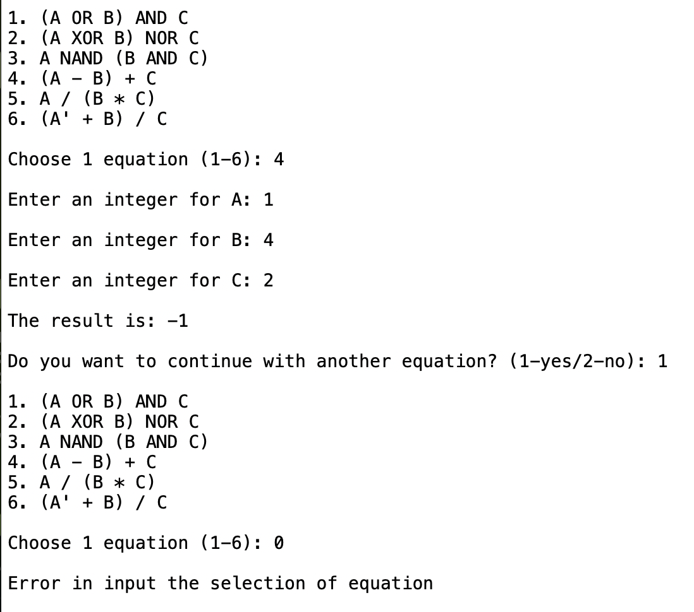

# Simple Operations using MIPS Assembly

MIPS assembly project for the ICOA assignment. This repository contains MIPS source you can run with MIPS simulators such as QtSpim.

## Profile

This project implements basic MIPS operations and small learning routines used in the ICOA assignment:

- Arithmetic: addition, subtraction, multiplication, division
- Logical and comparisons: AND, OR, NOT, XOR, NOR, NAND
- Memory: load/store word (`lw`, `sw`) and `.data` usage
- Control flow: loops, conditional and unconditional branching
- I/O: MIPS syscalls for printing and reading

## Files

- `ICOA_Assignment.asm` — main MIPS assembly source.

## Recommended tools

- `qtspim` — GUI/CLI MIPS simulator.

